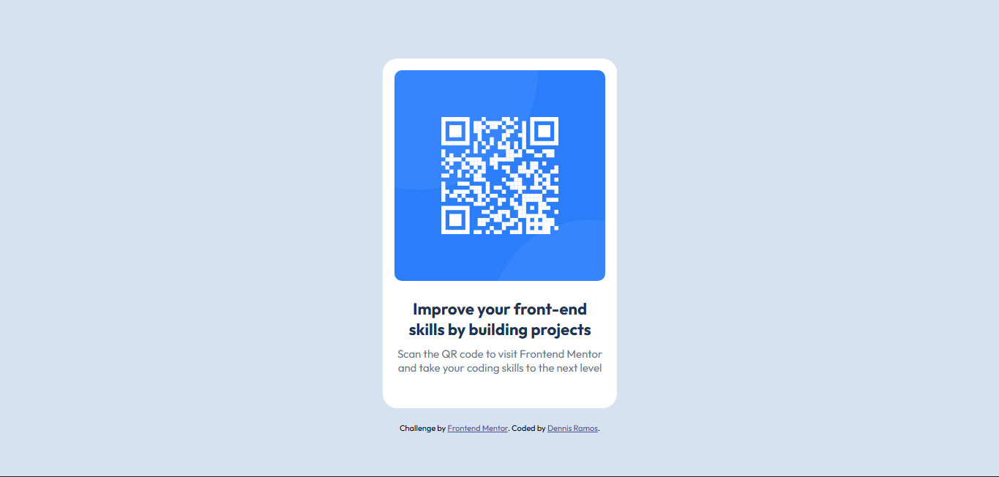

# qr-code-component-main

This is a solution to the [Qr code component challenge on Frontend Mentor](https://www.frontendmentor.io/challenges/qr-code-component-iux_sIO_H). Frontend Mentor help you improve your coding skills by building realistic projects.

## Table of Contents

- [Overview](#overview)
    - [Screenshot](#screenshot)
    - [Links](#links)
- [My Process](#my-process)
    - [Built with](#built-with)
    - [What I Learned](#what-i-learn)
    - [Continued development](#continued-development)
    - [Useful resources](#useful-resources)
- [Author](#author)
- [Acknowledgments](#acknowledgments)

## Overview


### Screenshot

[]()

[]()


### Links

- Solution URL: [Solution URL](https://github.com/Nicqq001/qr-code-component-main?tab=readme-ov-file)
- Live Site URL: [Live Site URL](https://nicqq001.github.io/qr-code-component-main/)


## My Process

### Built with

- Semantic HTML5 markup
- CSS
- Flexbox
- Mobile-first workflow

### What I Learned

What i learned is how to properly align the items between the body, section, and Img, at first I'm confused why the card or what i named class ".border", But after taking an hour to solve my problem, by doing

```css
.body{
    min-height: 100vh;
    display: center;
    justify-content: center;
    align-items: center;
}
```
By making this i can properly align the .border in the center of the browser. and making the .border

```css
.border{
    max-width: 320px;
    padding: 16px;
    margin: 20px;
}
```
and the next problem is the image of QR code, it's always in the left side of .border, but doing
this. The name of img class is .qr-code:

```css
.qr-code{
    width: 100%;
    border-radius: 10px;
}
```
By doing the 100% width, it can properly in the center of .border

### Continued development

I really want to continue mastering the css properly.

### Useful resources

- [Kevin Powell - Youtuber](https://www.youtube.com/@KevinPowell/videos) = This help me learn the flexbox and how properly align the body and section also the img.


## Author

- Github - [Dennis Roel T. Ramos](https://github.com/Nicqq001)


## Acknowledgments

Thanks to your challenge I learn how to use github how to use it in vscode, and Thank to Kevin Powell to
learn more in css.

# QR-Code-Frontend-Challenge
